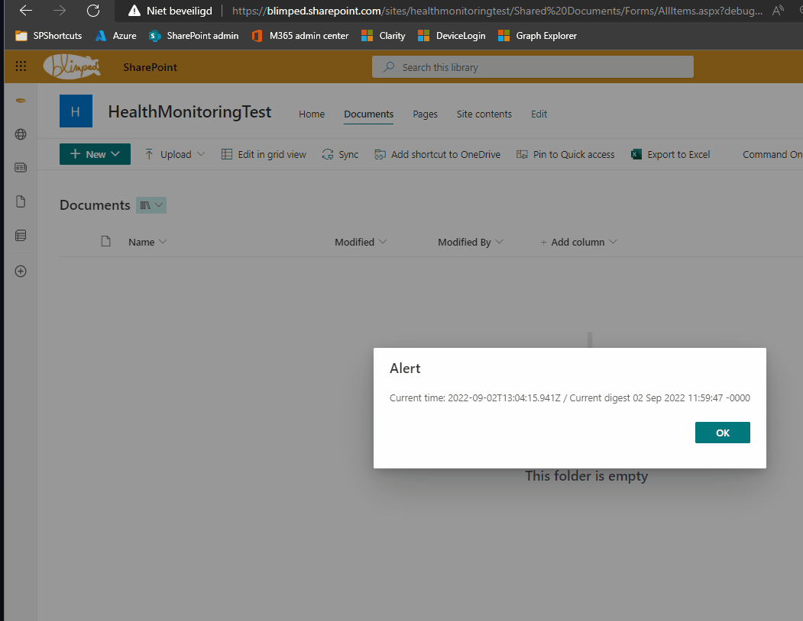

# SPFx extension Form Digest issue

## Summary
Showcases an exception with an invalid Formdigest in SPFx extensions. The sample shows an SPFx service, being consumed in an SPFx command set extension. The SPFx service consumes the page context and retieves the form digest to be able to call SharePoint endpoints using POST requests. After waiting for an hour, when refreshing the page, the form digest will not be refreshed appropriately. This will lead to 403 errors on post requests.

## Repro steps
1. Run `gulp serve --config helloWorld` and load the SPFx extension on a document library.
2. Click the `command one` command set button. It should show the current time and the time part of the form digest. These times should be roughly similar.
3. Leave the browser open for an hour
4. Click `Close` and click the `Command one` button again. Take note of the form digest value.
5. Now click the refresh button of your browser.
6. Click the command one button again. Take note of the form digest value. The form digest value has been updated, but it's still way behind the current time.

The following gif shows the problem in action:

The problems do not seem to occur in the SPFx webpart that I included.